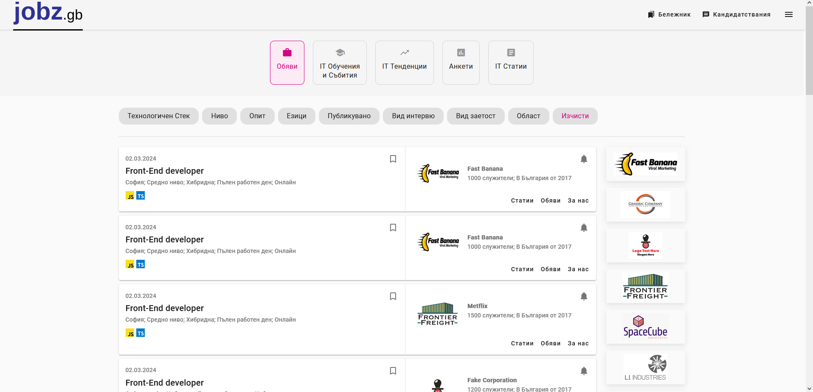

# Jobz

Jobz is a job board tailored for software workers, drawing inspiration from the Jobs.bg website. This project serves as a personal endeavor to hone full-stack development skills in a practical context. As a hobby project, it's a work in progress, embodying the learning journey in the realm of software development. Please enjoy exploring the functionalities it offers, keeping in mind its educational purpose.

## Tech-stack

This project leverages a modern tech stack to deliver a seamless and responsive user experience:

- **Frontend**: Angular 17+ with Angular Material
- **Backend**: NestJS
- **Database**: PostgreSQL
- **Authentication**: Auth0
- **Data Visualization**: D3.js (planned)

## Features

Jobz offers a comprehensive suite of features designed to cater to the diverse needs of the software community:

- **Job Board**: A central hub for finding and posting job listings, catering specifically to the software industry.
- **Education Board**: Discover courses and internships that can propel your career forward.
- **IT Trends**: Get insights into the latest industry trends with data-driven graphics and stats (Integration of D3.js planned).
- **Polls**: Engage with the community through interactive polls on various topics.
- **Blog**: Read and contribute to articles on a range of subjects, from technical tutorials to career advice.
- **Localization**: Accessible in both English and Bulgarian, making it versatile and user-friendly for a broader audience.
